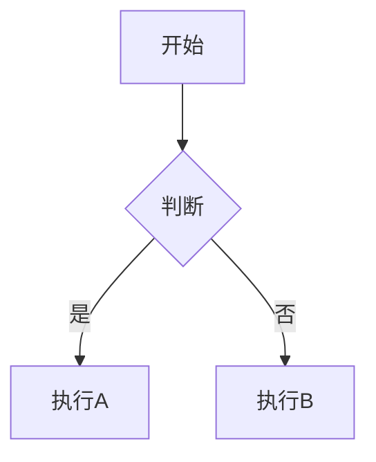

# Mermaid.js + VSCode 插件指南

> 本文档介绍如何在 VSCode 中完美渲染 Mermaid 图表

---

## 推荐插件

### 1. Markdown Preview Mermaid Support (推荐)

最简单的方式，安装这个插件可以直接在 Markdown 预览中渲染 Mermaid：

```
ext install: markdown-preview-mermaid-support
```

**VSCode Marketplace 链接**: https://marketplace.visualstudio.com/items?itemName=marcostazi.VS-code-mermaid-editor

---

### 2. Mermaid Preview

专门用于预览 Mermaid 图表的插件：

```
ext install: mmerian.mermaid-preview
```

功能：
- 实时预览 Mermaid 图表
- 支持多种图表类型
- 可导出为图片

---

### 3. Mermaid Editor

功能最强大的 Mermaid 编辑器：

```
ext install: mtxr.vscode-mermaid-editor
```

功能：
- 语法高亮
- 实时预览
- 图表导出
- 模板支持

---

## 安装步骤

### 方法 1: 从 VSCode 扩展商店安装

1. 打开 VSCode
2. 按 `Ctrl+Shift+P` (Mac: `Cmd+Shift+P`)
3. 输入 `Extensions: Install Extensions`
4. 搜索 `Mermaid`
5. 安装 `Mermaid Preview` 或 `Mermaid Editor`

### 方法 2: 从命令行安装

```bash
# 安装 Mermaid Preview
code --install-extension mmerian.mermaid-preview

# 安装 Mermaid Editor  
code --install-extension mtxr.vscode-mermaid-editor
```

---

## 使用方法

### 方式一：Markdown 文件中预览

1. 创建 `.md` 文件
2. 编写 Mermaid 代码块
3. 右键选择 `Open Preview` 或按 `Ctrl+Shift+V`

```markdown
# 我的文档


```

### 方式二：单独打开 Mermaid 文件

1. 创建 `.mermaid` 或 `.mmd` 文件
2. 按 `Ctrl+Shift+P`
3. 选择 `Mermaid: Open Preview`

---

## 在项目中查看文档

### 1. HTML 版本 (推荐)

```bash
# 进入项目目录
cd /workspace/project/quant-data-collect

# 启动本地服务器
python -m http.server 8080

# 浏览器打开
# http://localhost:8080/docs/diagrams.html
```

### 2. Markdown 版本 (需要插件)

```bash
# 打开 Mermaid 文件
code docs/TECHNICAL_DOCS_V2.md

# 按 Ctrl+Shift+V 打开预览
```

---

## 插件配置 (可选)

在 `settings.json` 中添加配置：

```json
{
    // Mermaid Preview 配置
    "mermaidPreview.enabled": true,
    "mermaidPreview.theme": "default",
    
    // Mermaid Editor 配置
    "mermaidEditor.useMaxWidth": true,
    "mermaidEditor.diagramMarginX": 50,
    "mermaidEditor.sequenceDiagram": {
        "actorMargin": 50,
        "messageMargin": 35
    }
}
```

---

## 常见问题

### Q: 为什么我的 Mermaid 图表不显示？

A: 检查以下几点：
1. 确认已安装插件
2. 确保代码块使用 `mermaid` 标识符
3. 尝试重启 VSCode

### Q: 图表显示不完整？

A: 尝试增加预览窗口大小，或使用 HTML 版本

### Q: 如何导出图表为图片？

A: 使用 `Mermaid Preview` 插件，右键图表选择 `Export as PNG`

---

## 替代方案

如果插件不工作，还可以：

1. **在线 Mermaid Editor**: https://mermaid.live
2. **Typora 编辑器**: 支持实时 Mermaid 渲染
3. **Obsidian**: 支持 Mermaid 插件
4. **Notion**: 支持 Mermaid 代码块

---

## 项目文档列表

| 文件 | 说明 |
|------|------|
| `docs/diagrams.html` | 🌟 **推荐** HTML + Mermaid.js 渲染版本 |
| `docs/TECHNICAL_DOCS_V2.md` | Mermaid 源码版本 (需插件) |
| `docs/TECHNICAL_DOCS.md` | 详细技术文档 |

---

## 快速开始

```bash
# 1. 克隆项目
git clone https://github.com/yhydev/quant-data-collect.git
cd quant-data-collect

# 2. 安装 VSCode 插件 (推荐 Mermaid Preview)
code --install-extension mmerian.mermaid-preview

# 3. 打开项目
code .

# 4. 打开文档
# - 方式A: 直接打开 diagrams.html 在浏览器查看
# - 方式B: 打开 TECHNICAL_DOCS_V2.md 并使用预览
```

---

> 💡 **提示**: 如果你只想快速查看图表，直接用浏览器打开 `docs/diagrams.html` 是最简单的方案，无需安装任何插件！
