# Binance 套利交易平台 - 详细技术文档

> 📚 本文档包含专业的架构图和时序图  
> 支持 Mermaid.js 实时渲染和 draw.io 编辑

---

## 目录
1. [系统架构图](#1-系统架构图)
2. [时序图 (Mermaid)](#2-时序图-mermaid)
3. [流程图](#3-流程图)
4. [数据库模型](#4-数据库模型)
5. [状态机](#5-状态机)
6. [draw.io 图表源文件](#6-drawio-图表源文件)

---

## 1. 系统架构图

### 1.1 整体系统架构

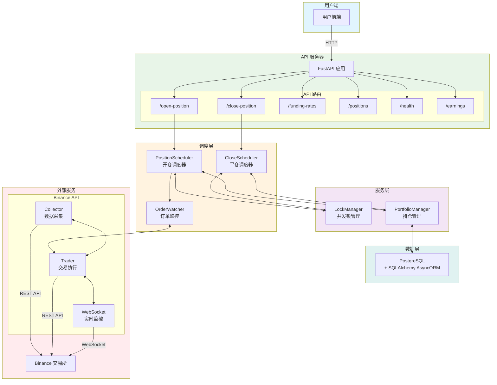

### 1.2 调度器内部架构

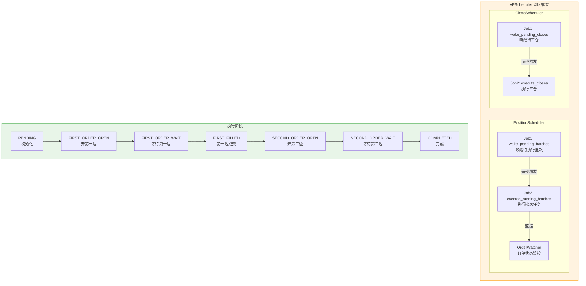

---

## 2. 时序图 (Mermaid)

### 2.1 开仓完整流程

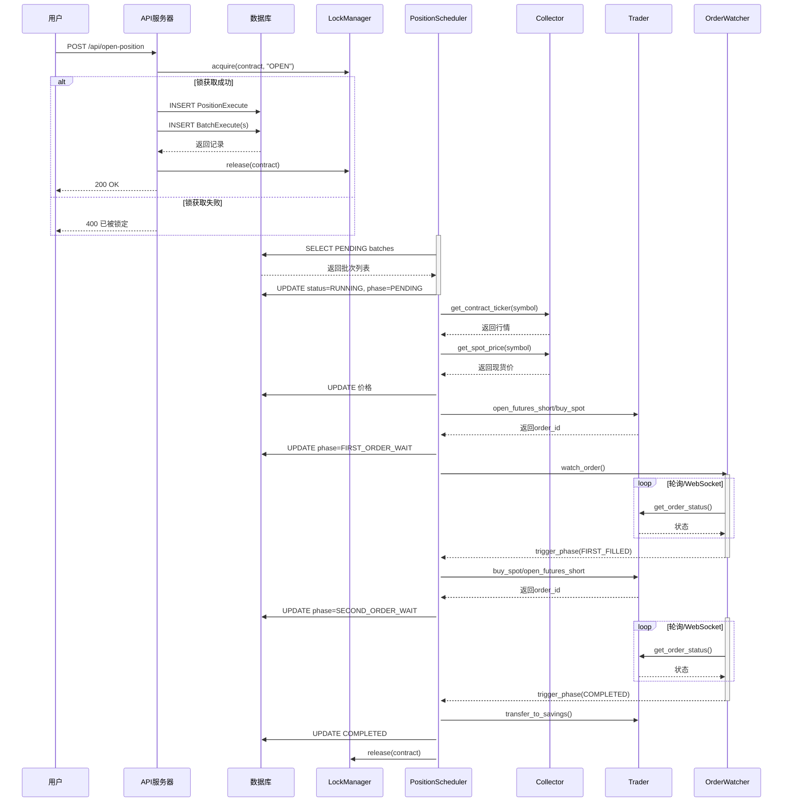

### 2.2 订单执行阶段 - 时序图详解

#### 阶段1: 初始化参数

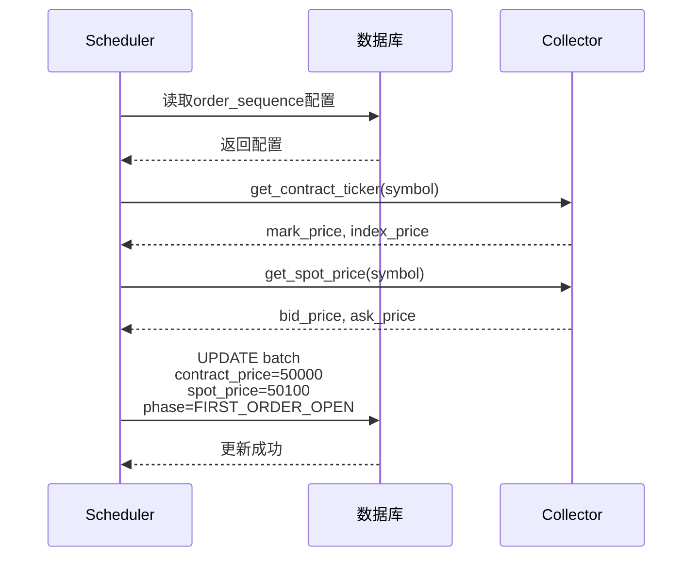

#### 阶段2: 开第一边订单

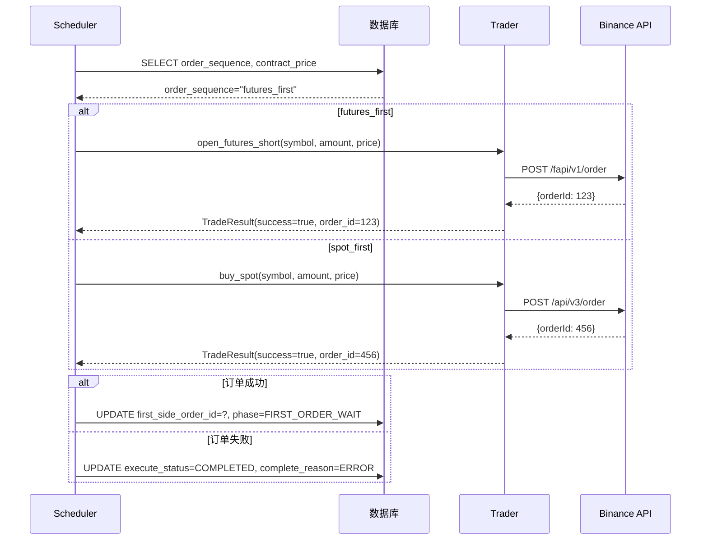

#### 阶段3-6: 等待成交循环

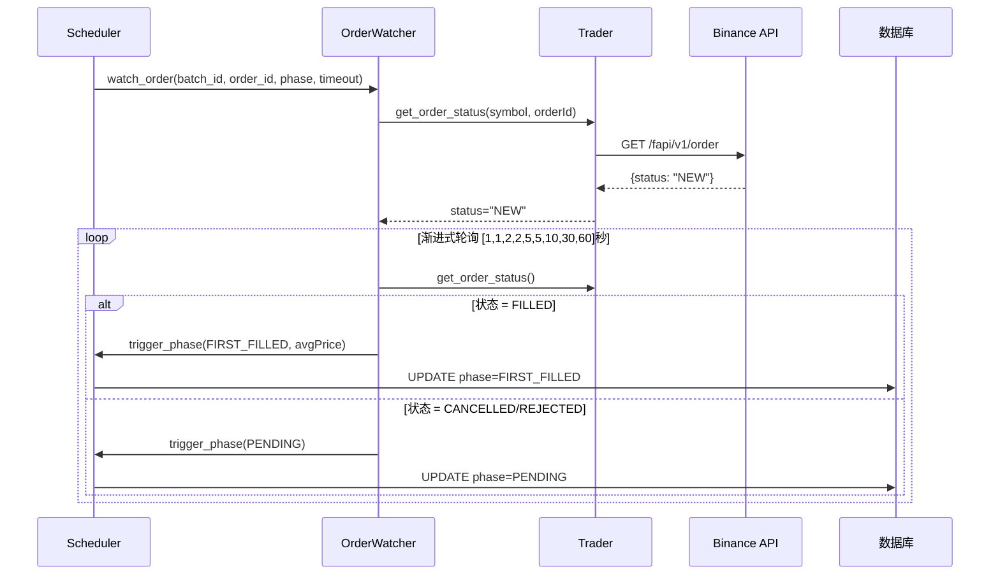

#### 阶段7: 完成并转入理财

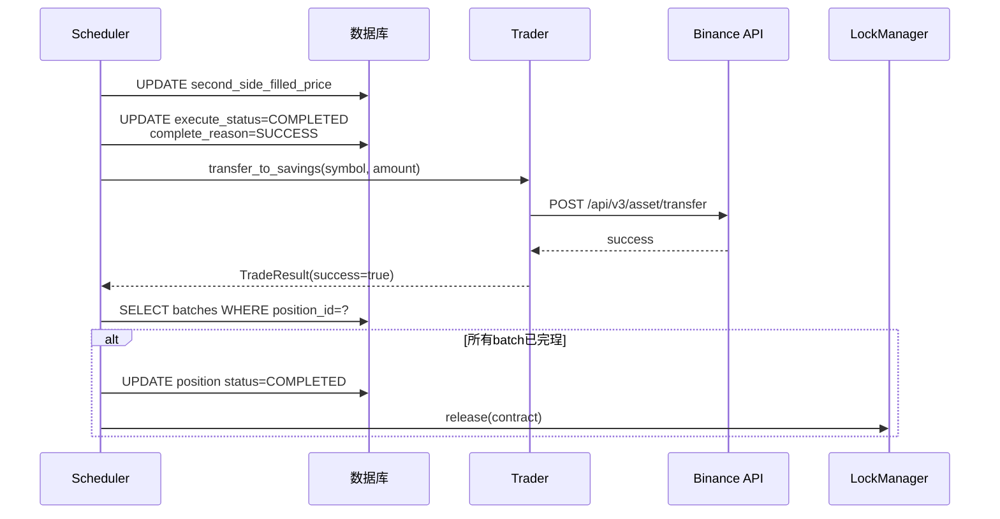

### 2.3 平仓流程

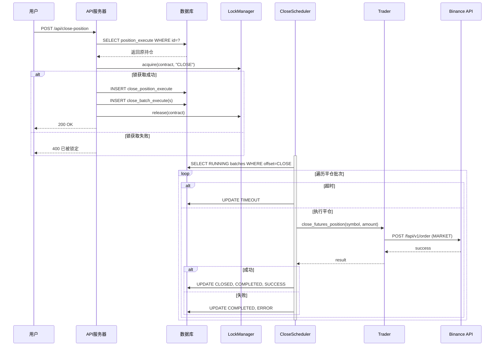

### 2.4 OrderWatcher 监控流程 (WebSocket + 轮询)

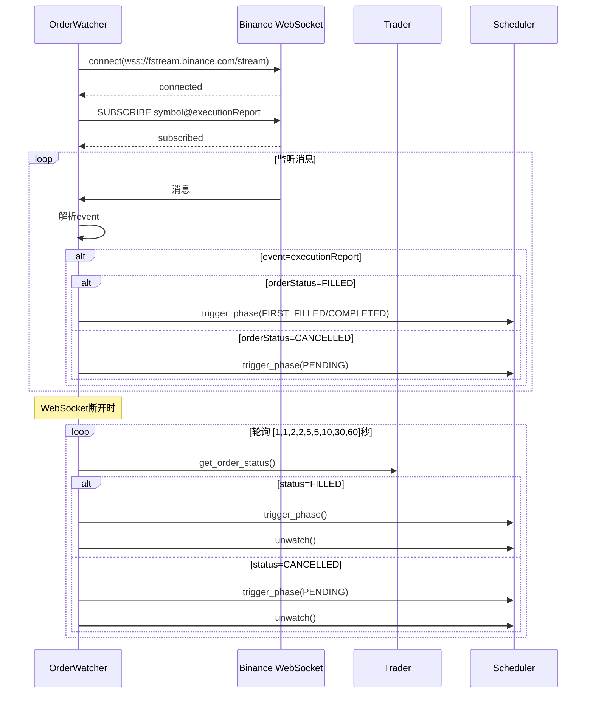

### 2.5 并发锁流程

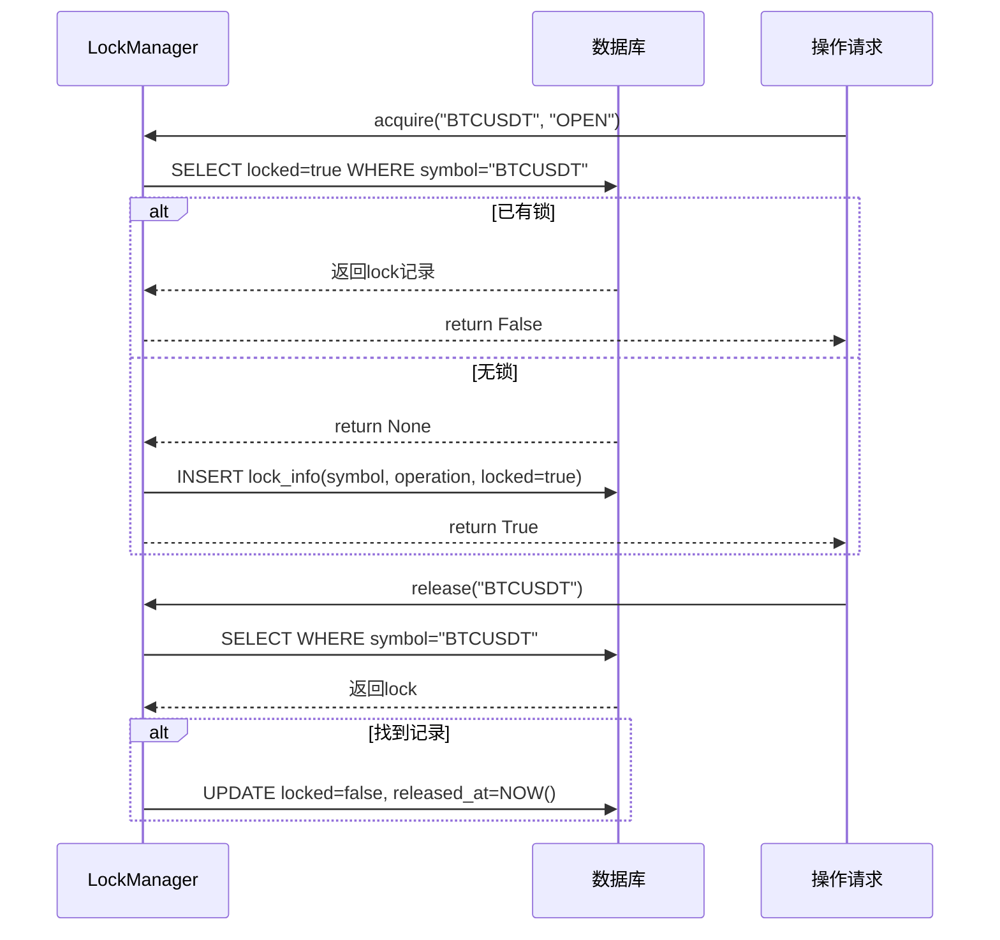

### 2.6 健康检查流程

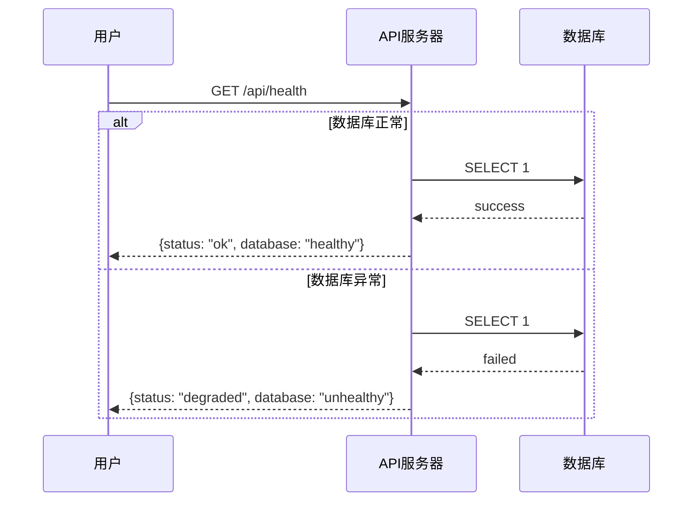

---

## 3. 流程图

### 3.1 开仓业务流

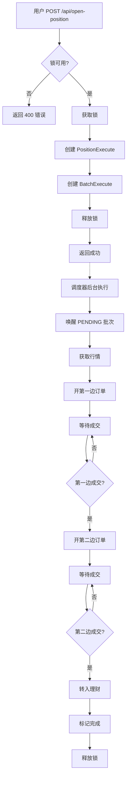

### 3.2 订单执行状态机

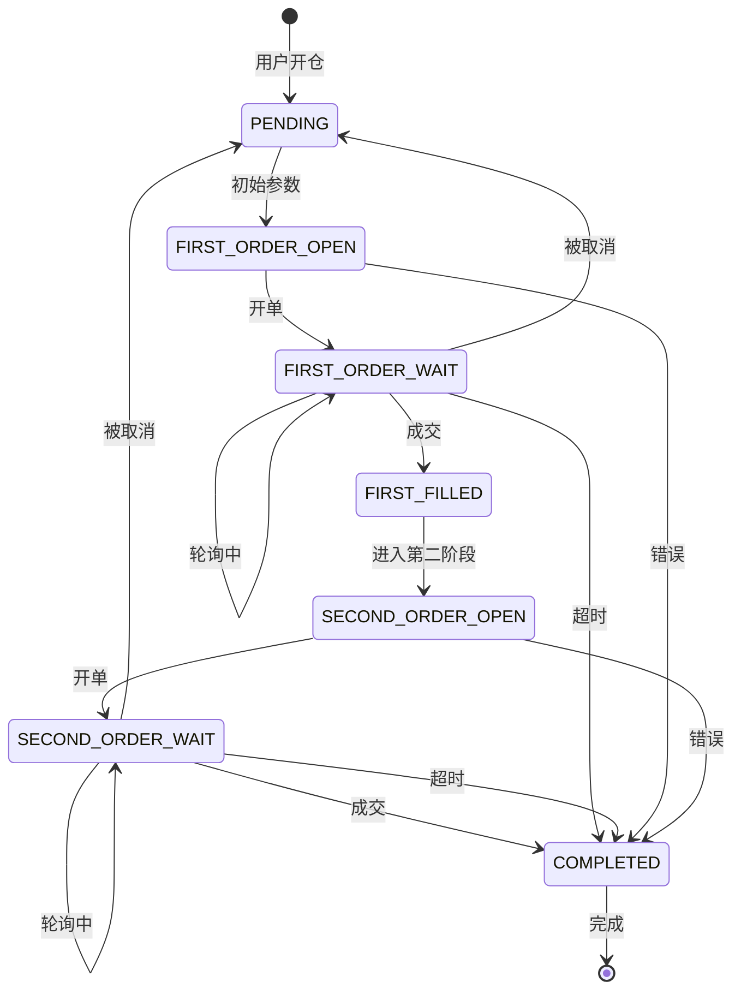

---

## 4. 数据库模型

### 4.1 ER 图

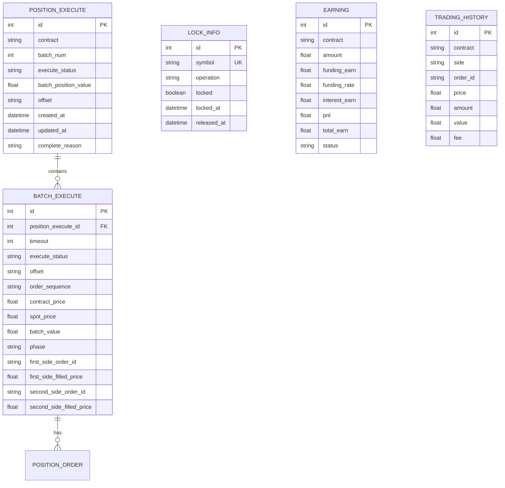

---

## 5. 状态机

### 5.1 订单执行阶段

```
┌─────────────────────────────────────────────────────────────────────┐
│                         订单执行状态机                                 │
├─────────────────────────────────────────────────────────────────────┤
│                                                                     │
│  ┌─────────┐    POST     ┌──────────────────┐    ORDER    ┌─────────────┐│
│  │ PENDING │ ────────>> │ FIRST_ORDER_OPEN │ ────────>> │ FIRST_ORDER ││
│  └─────────┘          └──────────────────┘           │   _WAIT   ││
│       ^                      │                      └─────┬──────┘│
│       │                     │                            │       │
│       │                SUCCESS                        FILLED ▼       │
│       │                                                  │       │
│       │  ┌──────────────────────────────────────────────┘       │
│       │  │                                                  │
│       │  ▼                                              ▼       │
│       │ ┌──────────────────┐   ORDER    ┌─────────────────┐       │
│       │ │ FIRST_FILLED    │ ────────>> │ SECOND_ORDER   │       │
│       │ └──────────────────┘           │     _OPEN    │       │
│       │                      │          └───────┬───────┘       │
│       │                      │              │              │
│       │                      │         SUCCESS▼              │
│       │                      │    ┌─────────────────┐        │
│       │                      └────│ SECOND_ORDER │        │
│       │                           │   _WAIT    │        │
│       │                           └─────┬───────┘        │
│       │                                 │              │
│       │                          ┌──────▼──────┐       │
│       │                          │COMPLETED   │        │
│       │                          └────────────┘        │
│       │                                 ^              │
│       │                                 │              │
│       │ TIMEOUT                      │              │
│       │<────────────────────────────┘              │
│                                                                     │
│  状态转换说明:                                              │
│  - POST: 创建订单                                          │
│  - ORDER: 发送订单到交易所                                     │
│  - FILLED: 订单成交                                        │
│  - TIMEOUT: 订单执行超时                                   │
│                                                                     │
└─────────────────────────────────────────────────────────────────────┘
```

---

## 6. draw.io 图表源文件

### 6.1 系统架构图 (draw.io)

请将以下内容保存为 `architecture.drawio` 并在 draw.io 中打开：

```xml
<mxfile host="app.diagrams.net" modified="2024-01-01T00:00:00.000Z" agent="OpenHands" version="22.1.0">
  <diagram id="system-architecture" name="System Architecture">
    <mxGraphModel dx="1200" dy="800" grid="1" gridSize="10" guides="1" tooltips="1" connect="1" arrows="1" fold="1" page="1" pageScale="1" pageWidth="1200" pageHeight="800" math="0" shadow="0">
      <root>
        <mxCell id="0" />
        <mxCell id="1" parent="0" />
        
        <!-- 用户端 -->
        <mxCell id="CLIENT" value="用户端 (Frontend)" style="rounded=1;whiteSpace=wrap;html=1;fillColor=#e1f5fe;strokeColor=#0277dd;" vertex="1" parent="1">
          <mxGeometry x="40" y="40" width="120" height="40" as="geometry" />
        </mxCell>
        
        <!-- API 服务器 -->
        <mxCell id="API_SERVER" value="API 服务器" style="rounded=1;whiteSpace=wrap;html=1;fillColor=#e8f5e8;strokeColor=#2e7d32;" vertex="1" parent="1">
          <mxGeometry x="200" y="40" width="120" height="40" as="geometry" />
        </mxCell>
        
        <!-- 调度器 -->
        <mxCell id="SCHEDULER" value="调度层 (APScheduler)" style="rounded=1;whiteSpace=wrap;html=1;fillColor=#fff3e0;strokeColor=#ef6c00;" vertex="1" parent="1">
          <mxGeometry x="380" y="40" width="140" height="40" as="geometry" />
        </mxCell>
        
        <!-- 数据库 -->
        <mxCell id="DATABASE" value="PostgreSQL" style="shape=cylinder;whiteSpace=wrap;html=1;bounded=1;fillColor=#e0f2f1;strokeColor=#00695c;" vertex="1" parent="1">
          <mxGeometry x="560" y="40" width="100" height="50" as="geometry" />
        </mxCell>
        
        <!-- Binance -->
        <mxCell id="BINANCE" value="Binance 交易所" style="rounded=1;whiteSpace=wrap;html=1;fillColor=#ffebee;strokeColor=#c62828;" vertex="1" parent="1">
          <mxGeometry x="740" y="40" width="120" height="40" as="geometry" />
        </mxCell>
        
        <!-- 连接线 -->
        <mxCell id="E1" style="edgeStyle=orthogonalEdgeStyle;rounded=0;orthogonalLoop=1;" edge="1" parent="1" source="CLIENT" target="API_SERVER">
          <mxGeometry as="geometry" />
        </mxCell>
        <mxCell id="E2" style="edgeStyle=orthogonalEdgeStyle;rounded=0;orthogonalLoop=1;" edge="1" parent="1" source="API_SERVER" target="SCHEDULER">
          <mxGeometry as="geometry" />
        </mxCell>
        <mxCell id="E3" style="edgeStyle=orthogonalEdgeStyle;rounded=0;orthogonalLoop=1;" edge="1" parent="1" source="SCHEDULER" target="DATABASE">
          <mxGeometry as="geometry" />
        </mxCell>
        <mxCell id="E4" style="edgeStyle=orthogonalEdgeStyle;rounded=0;orthogonalLoop=1;" edge="1" parent="1" source="SCHEDULER" target="BINANCE">
          <mxGeometry as="geometry" />
        </mxCell>
      </root>
    </mxGraphModel>
  </diagram>
</mxfile>
```

### 6.2 时序图模板 (draw.io)

```xml
<mxfile host="app.diagrams.net" modified="2024-01-01T00:00:00.000Z" agent="OpenHands" version="22.1.0">
  <diagram id="sequence-diagram" name="Sequence Diagram">
    <mxGraphModel dx="1200" dy="800" grid="1" gridSize="10" guides="1" tooltips="1" connect="1" arrows="1" fold="1" page="1" pageScale="1" pageWidth="1200" pageHeight="800" math="0" shadow="0">
      <root>
        <mxCell id="0" />
        <mxCell id="1" parent="0" />
        
        <!-- 角色头部 -->
        <mxCell id="ACTOR1" value="用户" style="rounded=0;whiteSpace=wrap;html=1;fillColor=#e3f2fd;strokeColor=#1565c0;" vertex="1" parent="1">
          <mxGeometry x="40" y="40" width="80" height="30" as="geometry" />
        </mxCell>
        <mxCell id="ACTOR2" value="API" style="rounded=0;whiteSpace=wrap;html=1;fillColor=#e8f5e8;strokeColor=#2e7d32;" vertex="1" parent="1">
          <mxGeometry x="160" y="40" width="80" height="30" as="geometry" />
        </mxCell>
        <mxCell id="ACTOR3" value="数据库" style="rounded=0;whiteSpace=wrap;html=1;fillColor=#e0f2f1;strokeColor=#00695c;" vertex="1" parent="1">
          <mxGeometry x="280" y="40" width="80" height="30" as="geometry" />
        </mxCell>
        
        <!-- 时序线 -->
        <mxCell id="LINE1" value="" style="endArrow=classic;html=1;dashed=1;" edge="1" parent="1">
          <mxGeometry as="geometry">
            <mxPoint x="80" y="70" as="sourcePoint" />
            <mxPoint x="80" y="280" as="targetPoint" />
          </mxGeometry>
        </mxCell>
        <mxCell id="LINE2" value="" style="endArrow=classic;html=1;dashed=1;" edge="1" parent="1">
          <mxGeometry as="geometry">
            <mxPoint x="200" y="70" as="sourcePoint" />
            <mxPoint x="200" y="280" as="targetPoint" />
          </mxGeometry>
        </mxCell>
        <mxCell id="LINE3" value="" style="endArrow=classic;html=1;dashed=1;" edge="1" parent="1">
          <mxGeometry as="geometry">
            <mxPoint x="320" y="70" as="sourcePoint" />
            <mxPoint x="320" y="280" as="targetPoint" />
          </mxGeometry>
        </mxCell>
        
        <!-- 消息箭头示例 -->
        <mxCell id="MSG1" value="1. POST /api/open-position" style="endArrow=classic;html=1;" edge="1" parent="1">
          <mxGeometry as="geometry">
            <mxPoint x="80" y="90" as="sourcePoint" />
            <mxPoint x="200" y="90" as="targetPoint" />
          </mxGeometry>
        </mxCell>
        <mxCell id="MSG2" value="2. INSERT" style="endArrow=classic;html=1;" edge="1" parent="1">
          <mxGeometry as="geometry">
            <mxPoint x="200" y="120" as="sourcePoint" />
            <mxPoint x="320" y="120" as="targetPoint" />
          </mxGeometry>
        </mxCell>
      </root>
    </mxGraphModel>
  </diagram>
</mxfile>
```

### 6.3 状态机图 (draw.io)

```xml
<mxfile host="app.diagrams.net" modified="2024-01-01T00:00:00.000Z" agent="OpenHands" version="22.1.0">
  <diagram id="state-machine" name="State Machine">
    <mxGraphModel dx="800" dy="600" grid="1" gridSize="10" guides="1" tooltips="1" connect="1" arrows="1" fold="1" page="1" pageScale="1" pageWidth="800" pageHeight="600" math="0" shadow="0">
      <root>
        <mxCell id="0" />
        <mxCell id="1" parent="0" />
        
        <!-- PENDING -->
        <mxCell id="S1" value="PENDING" style="ellipse;whiteSpace=wrap;html=1;fillColor=#fff3e0;strokeColor=#ef6c00;" vertex="1" parent="1">
          <mxGeometry x="80" y="120" width="100" height="50" as="geometry" />
        </mxCell>
        
        <!-- FIRST_ORDER_OPEN -->
        <mxCell id="S2" value="FIRST_ORDER&#xa;OPEN" style="ellipse;whiteSpace=wrap;html=1;fillColor=#e3f2fd;strokeColor=#1565c0;" vertex="1" parent="1">
          <mxGeometry x="240" y="120" width="100" height="50" as="geometry" />
        </mxCell>
        
        <!-- FIRST_ORDER_WAIT -->
        <mxCell id="S3" value="FIRST_ORDER&#xa;WAIT" style="ellipse;whiteSpace=wrap;html=1;fillColor=#e8f5e8;strokeColor=#2e7d32;" vertex="1" parent="1">
          <mxGeometry x="400" y="120" width="100" height="50" as="geometry" />
        </mxCell>
        
        <!-- FIRST_FILLED -->
        <mxCell id="S4" value="FIRST_FILLED" style="ellipse;whiteSpace=wrap;html=1;fillColor=#fce4ec;strokeColor=#ad1457;" vertex="1" parent="1">
          <mxGeometry x="560" y="120" width="100" height="50" as="geometry" />
        </mxCell>
        
        <!-- COMPLETED -->
        <mxCell id="S5" value="COMPLETED" style="ellipse;whiteSpace=wrap;html=1;fillColor=#e0f2f1;strokeColor=#00695c;" vertex="1" parent="1">
          <mxGeometry x="320" y="280" width="100" height="50" as="geometry" />
        </mxCell>
        
        <!-- 状态转移 -->
        <mxCell id="T1" value="INIT" style="endArrow=classic;html=1;dashed=1;" edge="1" parent="1" source="S1" target="S2">
          <mxGeometry as="geometry" />
        </mxCell>
        <mxCell id="T2" value="ORDER" style="endArrow=classic;html=1;dashed=1;" edge="1" parent="1" source="S2" target="S3">
          <mxGeometry as="geometry" />
        </mxCell>
        <mxCell id="T3" value="FILLED" style="endArrow=classic;html=1;dashed=1;" edge="1" parent="1" source="S3" target="S4">
          <mxGeometry as="geometry" />
        </mxCell>
        <mxCell id="T4" value="NEXT" style="endArrow=classic;html=1;dashed=1;" edge="1" parent="1" source="S4" target="S5">
          <mxGeometry as="geometry" />
        </mxCell>
        <mxCell id="T5" value="TIMEOUT" style="endArrow=classic;html=1;dashed=1;" edge="1" parent="1" source="S3" target="S5">
          <mxGeometry as="geometry">
            <Array as="points">
              <mxPoint x="480" y="200" />
              <mxPoint x="480" y="280" />
            </Array>
          </mxGeometry>
        </mxCell>
      </root>
    </mxGraphModel>
  </diagram>
</mxfile>
```

---

## 7. API 接口汇总表

| 方法 | 路径 | 说明 | 请求体 | 响应 |
|------|------|------|--------|------|
| POST | /api/open-position | 开仓 | {contract, batch_num, ...} | {status, message} |
| POST | /api/close-position | 平仓 | {position_id, ...} | {status, message} |
| GET | /api/funding-rates | 资金费率 | - | [{symbol, rate, ...}] |
| GET | /api/positions | 持仓列表 | - | [{id, contract, ...}] |
| GET | /api/positions/{id} | 持仓详情 | - | {id, contract, ...} |
| GET | /api/positions/{id}/progress | 开仓进度 | - | {...} |
| GET | /api/batch-detail/{id} | 批次详情 | - | {...} |
| GET | /api/earnings | 收益列表 | - | [{contract, amount, ...}] |
| GET | /api/health | 健康检查 | - | {status, database} |
| GET | /api/plugins | 插件列表 | - | [{name, type, ...}] |
| POST | /api/plugins/set | 设置插件 | {plugin_name} | {status, message} |

---

## 8. 配置环境变量

| 变量 | 默认值 | 说明 |
|------|--------|------|
| POSTGRES_HOST | localhost | 数据库地址 |
| POSTGRES_PORT | 5432 | 数据库端口 |
| POSTGRES_USER | postgres | 数据库用户 |
| POSTGRES_PASSWORD | postgres | 数据库密码 |
| POSTGRES_DB | arbitrage | 数据库名 |
| BINANCE_API_KEY | - | 币安API Key |
| BINANCE_SECRET_KEY | - | 币安Secret Key |
| CORS_ORIGINS | http://localhost:3000,... | CORS允许的源 |
| DB_POOL_SIZE | 5 | 数据库连接池大小 |
| DB_MAX_OVERFLOW | 10 | 最大溢出连接数 |
| LOG_LEVEL | INFO | 日志级别 |

---

> 💡 **提示**: 
> - Mermaid.js 图表可在 GitHub、Notion、Typora 等支持 Mermaid 的编辑器中实时渲染
> - draw.io XML 文件可导入 draw.io 继续编辑
> - 推荐使用 VS Code + Markdown Preview Supported 插件查看本文档